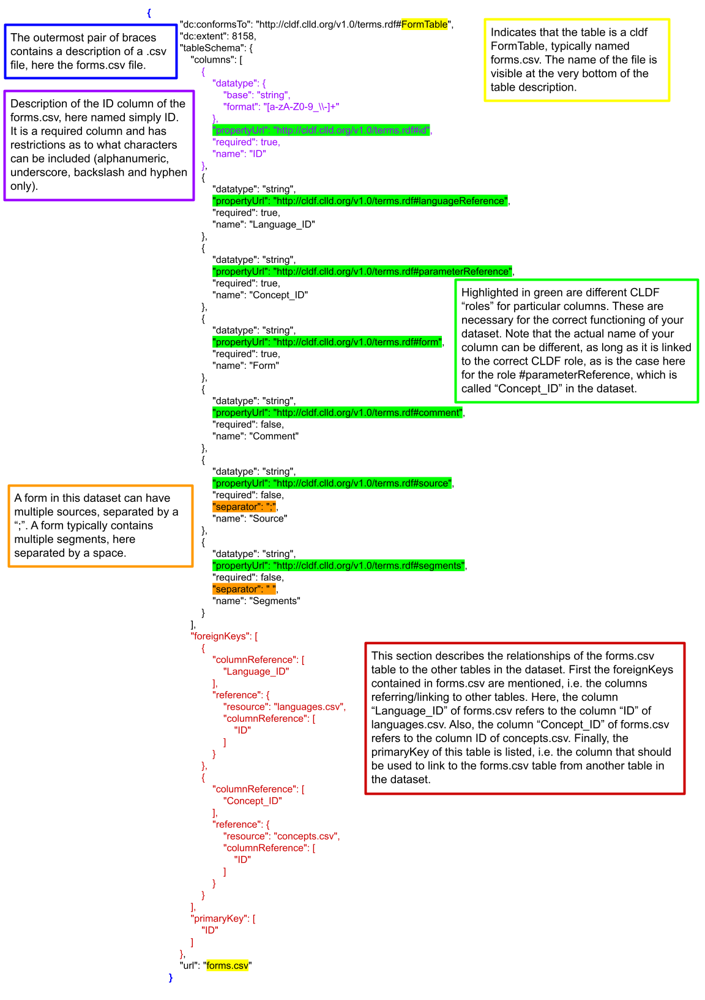

# The CLDF format
The CLDF format is designed for sharing and reusing comparative linguistic data. A CLDF lexical dataset consists of a series of tables (.csv files), a metadata (.json) file describing the structure of each table and their inter-relationships, and a bibliography (.bib) file containing the relevant sources. A typical CLDF lexical dataset consists of the following tables: LanguageTable, ParameterTable (listing concepts), FormTable, CognatesetTable, and CognateTable. Not all files are necessary: the bare minimum for a valid CLDF dataset is a FormTable. However, lexedata requires a metadata file for almost every operation.

Each table (.csv file) has to have an ID column. Below, we briefly describe the typical files of a lexical CLDF dataset and how they interact with Lexedata when necessary. For each file, you can find below the necessary columns and typical columns. You can always add any custom columns as needed for your dataset. There is also the possibility to add further tables depending on your needs. For more information on the CLDF format, you can refer to https://cldf.clld.org/.

We recommend that you keep all these files in one folder which is versioned with git. You can use Github or Gitlab for this purpose.

## The LanguageTable
The `languages.csv` file contains the different varieties included in your lexical dataset and their metadata. Every row is a variety.

 - Necessary columns: Language_ID
 - Typical columns: Name

## The ParameterTable (concepts)
The `parameters.csv` file (sometimes also named `concepts.csv` in datasets with manually created metadata) contains the different concepts (meanings) included in your lexical dataset. Every row is a concept.

 - Necessary columns: Parameter_ID
 - Typical columns: Name, Definition, Concepticon_ID

## The FormTable
The `forms.csv` file is the core of a lexical dataset.
A well-structured `forms.csv` on its own, even without accompanying metadata, can already be understood as a lexical dataset by many CLDF-aware applications.
The table contains all the different forms included in your dataset. Every row is a form with its associated metadata. To add page numbers for the sources in the cldf format, you should use the format source[page]. You can have different page numbers and page ranges within the square brackets (e.g. `smith2003[45, 48, 52-56]`).

 - Necessary columns: Form_ID, Form, Concept_ID, Language_ID
 - Typical columns: Comment, Segments, Source

## The CognatesetTable
The `cognatesets.csv` file contains the cognate sets included in your dataset and their metadata. Every row is a cognate set. Note that, depending on the dataset, cognate set here can either mean cross-concept cognate set (all forms descending from the same protoform), or within-concept cognate set (all forms descending from the same protoform that have the same meaning).

- Necessary columns: Cognateset_ID
- Typical columns: Comment, Source

## The CognateTable (judgements)
The `cognates.csv` file contains all the individual cognate judgements included in the dataset, i.e. it links every form to the cognateset it belongs to. Every row is a cognate judgement. Note that it is possible to have forms belonging to multiple cognate sets (e.g. to account for partial cognacy). Another way of accommodating partial cognacy is to assign parts of forms to different cognate sets, by using the Segment_Slice column.

- Necessary columns: Cognate_ID, Form_ID, Cognateset_ID
- Typical columns: Comment, Segment_Slice

## The bibliography
The `sources.bib` file contains references to all sources used in the dataset. The entries in the Source column of the forms.csv (or any other table) must be identical to a handle (unique code) of a reference in the `sources.bib`.

## The metadata file
The `Wordlist-metadata.json` file contains a detailed description of all the CSV files, their columns and their interrelationships. It is not required for a CLDF dataset, but it is necessary for the vast majority of operations using lexedata. For simple datasets, lexedata can create automatically a metadata file. However, for more complex datasets, you would need to provide one yourself.
<!--- TODO: add some support for making a json file--->

For an example of a simple metadata file, see XXX. Every change to the structure of the dataset (e.g. insertion or deletion of a column in any table) needs to be reflected in the netadata file for the dataset to be a valid cldf dataset.
<!-- TO DO: add a reference to sample files and sample datasets --> 
Below you can see a typical description of a table in the metadata file.

