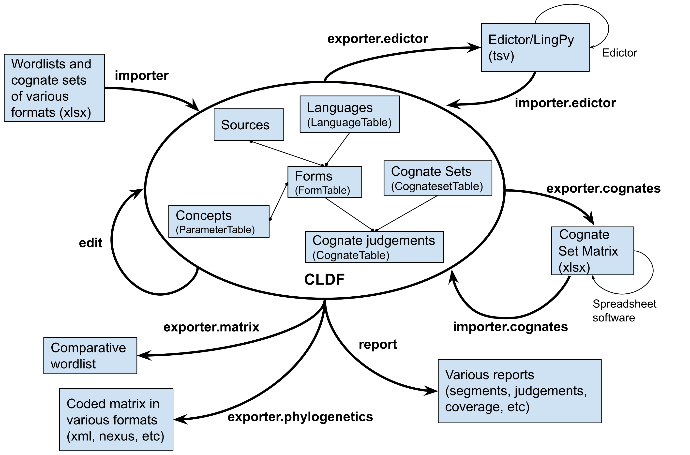

# Summary
Lexedata is a collection of tools to support the editing process of comparative
lexical data. Wordlists are a comparatively easily
collected type of language documentation that is nonetheless quite data-rich and useful for the systematic
comparison of languages [@list2021lexibank]. They are an important resource in
comparative and historical linguistics, including their use as raw data for
language phylogenetics [@gray2009language;@grollemund2015bantu].

The `lexedata` toolbox package uses the “Cross-Linguistic Data Format” (CLDF,
@cldf11, @cldf-paper) as main data format for a relational database containing
forms, languages, concepts, and etymological relationships. The CLDF
specification builds on top of the CSV for the Web (CSVW,
@pollock2015metadata) specs by the W3C, and as such consists of one or more
comma-separated value (CSV) files that get their semantics from a metadata file
in JSON format.

Implemented in Python as a set of command line tools, Lexedata provides various
helper functions that frequently arise when working with comparative wordlists
for multiple languages, as shown in \autoref{fig:structure}. These include
import and export functions to formats more familiar to linguists, and integrity
checks for bulk edit and import functionality it provides. For example, there
are scripts for importing data from MS Excel sheets of various common formats
into CLDF, checking for homophones, manipulating etymological
judgements, or exporting datasets for use in phylogenetic software.

# Statement of Need

Maintaining the integrity of CLDF as relational database is difficult using
general CSV editing tools. This holds in particular for the usual dataset size
of hundreds of languages and concepts, and formats unfamiliar to most linguists.
Dedicated relational database software simplifies the maintenance of the data
structures, but sets an even bigger hurdle even to researchers who are
reasonably computer-savy.

The major existing tool for curating lexical datasets in other formats and
providing them as CLDF for interoperability is cldfbench [@cldfbench]. However,
it assumes that the data curator is not in a position to edit the dataset. As
such, it must provide a very flexible interface to transform and curate CLDF
datasets, at the cost of making this accessible through an API which requires
the writing of Python code.

Given that a majority of comparative linguists are unfamiliar with programming,
Lexedata is designed to not need any programming skills. In contrast with
cldfbench, Lexedata is written for the purpose of not only curating, but also
collecting and editing the dataset. It therefore imposes additional constraints
on the dataset which are very useful in editing tasks, but not strictly required
by CLDF in general.

Lexedata provides export and import functionality for the format used by LingPy
[@lingpy] and Edictor [@edictor]. Edictor is a browser-based graphical user
interface tool to edit cognate annotations, while LingPy is a Python library
focused on automating manipulations of lexical datasets, such as automatic
cognate detection. Both of these pre-date the CLDF format, and while their
common data format inspired some features of CLDF, it has some differences. In
addition to converting this TSV-based format to and from CLDF, Lexedata exposes
a major LingPy functionality, the Automatic Cognate Detection (ACD,
@list2017potential) using Lexstat [@list2012lexstat], to work directly on CLDF
datasets. This avoids both having to convert to and from LingPy and memory
issues arising from LingPy's approach to load the entire dataset into memory.

In summary, Lexedata makes it possible to curate and edit a lexical dataset in
CLDF format without the need to be able to program, which is still a rare skill
among comparative linguists. It allows this without sacrificing the power and
familiarity of existing software such as GUI spreadsheed apps or Edictor, by
making format conversions and bulk editing functionality accessible from simple
terminal commands.

# Research use
The export to phylogenetic alignments, derived from BEASTling
[@maurits2017beastling;@beastling14], has already been used in different language
phylogenetics projects that are currently under review
[@kaiping2019subgrouping;@kaiping2021burst]. The
more extensive lexical dataset editing functionality is used by projects
at UC Berkeley and Universität Zürich for Arawakan and Mawetí-Guaraní languages
and
at Universiteit Gent for Bantu [@gunnink2022bantu].
Precursor scripts have also
been used for Timor-Alor-Pantar and Austronesian languages [@lexirumah-paper].

# Acknowledgement
Development of Lexedata was funded by the Swiss National Science Foundation
(SNSF) Sinergia Project “Out of Asia” CRSII5_183578.

# References
