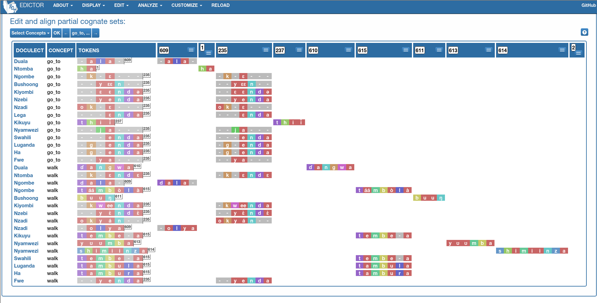

##################
A tour of lexedata
##################

This tutorial will take you on a tour through the command line functionality of
the lexedata package. We will start with a small lexical dataset in an
interleaved tabular format, where each column corresponds to a language and each
pair of rows to a concept, with preliminary cognate codes. We will take you
through turning the dataset into CLDF, editing cognate judgements, and
exporting the dataset as a phylogenetic alignment.

(To prevent this tutorial from becoming obsolete, our continuous integration
testing system ‘follows’ this tutorial when we update the software. So if it
appears overly verbose or rigid to you at times, it is because it has a secondary
function as test case. This is also the reason we use the command line where we
can, even in places where a GUI tool would be handy: Our continuous integration
tester cannot use the GUI.) ::

    $ python -m lexedata.importer.excel_interleaved --help
    [...]
    $ export LANG=C

Lexedata is a collection of command line tools. If you have never worked on the
command line before, check out :doc:`our quick primer on the command line
<cli>`. This tutorial further assumes you have a working :doc:`installation` of
lexedata and :doc:`git`. The tutorial will manipulate the Git repository using
Git's command line interface, but you can use a Git GUI instead. While it is
possible to use lexedata without Git, we do not recommend this, as lexedata does
not have an 'undo' function. Git is a version control system and allows you to
access and restore previous versions, while it also makes collaboration with
others easier.

*****************************
Importing a dataset into CLDF
*****************************

First, create a new empty directory. We will collect the data and run
the analyses inside that folder. Open a command line interface, and
make sure its working directory is that new folder. For example,
start the terminal and execute ::

    $ mkdir bantu
    $ cd bantu

For this tutorial, we will be using lexical data from the Bantu family,
collected by Hilde Gunnink. The dataset is a subset of an earlier version
(deliberately, so this tour can show some steps in the cleaning process) of her
lexical dataset. The data is stored in an Excel file which you can download from
https://github.com/Anaphory/lexedata/blob/master/src/lexeadata/data/example-bantu.xlsx
in the lexedata repository. (We will use the most recent version here, which
comes shipped with lexedata. Sorry this looks a bit cryptic, but as we said, this
way the testing system also knows where to find the file.) ::

    $ python -c 'import pkg_resources; open("bantu.xlsx", "wb").write(pkg_resources.resource_stream("lexedata", "data/example-bantu.xlsx").read())'

If you look at this data (we will do it in Python, but feel free to open it in
Excel), you will see that ::

    $ python -c 'from openpyxl import load_workbook
    > for row in load_workbook("bantu.xlsx").active.iter_rows():
    >   row_text = [(c.value or "").strip() for c in row]
    >   if any(row_text):
    >     print(*row_text, sep="\t")' # doctest: +NORMALIZE_WHITESPACE
            Duala      Ntomba      Ngombe                       Bushoong                   [...]
    all     ɓɛ́sɛ̃       (nk)umá     ńsò (Bastin et al 1999)      kim (Bastin et al 1999)    [...]
            1          9           10                           11                         [...]
    arm     dia        lobɔ́kɔ      lò-bókò (PL: màbókò) [...]   lɔ̀ɔ́ (Bastin et al 1999)    [...]
            7          1           1                            1                          [...]
    ashes   mabúdú     metókó      búdùlù ~ pùdùlù ([...])      bu-tók (Bastin et al 1999) [...]
            17         16          17                           16                         [...]
    [...]

it is table with one column for each language, and every pair of rows contains
the data for one concept. The first row of each pair contains the forms for the
concept (a cell can have multiple forms separated by comma), and the second row
contains cognacy judgements for those forms.

This is one of several formats supported by lexedata for import. The
corresponding importer is called ``excel_interleaved`` and it works like this::

    $ python -m lexedata.importer.excel_interleaved --help
    usage: python -m lexedata.importer.excel_interleaved [-h]
                                                         [--sheets SHEET [SHEET ...]]
                                                         [--directory DIRECTORY]
                                                         [--loglevel LOGLEVEL]
                                                         [-q] [-v]
                                                         EXCEL

    Import data in the "interleaved" format from an Excel spreadsheet. [...]
    [...]

    positional arguments:
      EXCEL                 The Excel file to parse

    option[...]:
      -h, --help            show this help message and exit
      --sheets SHEET [SHEET ...]
                            Excel sheet name(s) to import (default: all sheets)
      --directory DIRECTORY
                            Path to directory where forms.csv is to be created
                            (default: current working directory)

    Logging:
      --loglevel LOGLEVEL
      -q
      -v

So this importer needs to be told which Excel file to import, and it can be
told about the destination directory of the import and about sheet names to
import, e.g. if your Excel file contains additional non-wordlist data in separate
worksheets.

Like nearly every lexedata script, this one has logging controls to change the
verbosity. There are 5 levels of logging: CRITICAL, ERROR, WARNING, INFO, and
DEBUG. Normally, scripts operate on the INFO level: They tell you about
anything that might be relevant about the progress and successes. If that's too
much output, you can make it *-q*-uieter to only display warnings, which tells you
where the script found data not up to standard and had to fall
back to some workaround to proceed. Even less output happens on the ERROR level
(“Your data had issues that made me unable to complete the current step, but I
can still recover to do *something* more”) and the CRITICAL level (“I found
something that makes me unable to proceed at all.”). We run many of the examples
here in quiet mode, you probably don't want to do that.

With that in mind, we can run the interleaved importer simply with the Excel
file as argument::

    $ python -m lexedata.importer.excel_interleaved -q bantu.xlsx
    WARNING:lexedata:F48: Multiple forms (ly-aki, ma-ki) did not match single cognateset (1), using that cognateset for each form.
    WARNING:lexedata:H30: Multiple forms (képié, mpfô) did not match single cognateset (9), using that cognateset for each form.
    WARNING:lexedata:H90: Multiple forms (o-zyâ, o-jib) did not match single cognateset (1), using that cognateset for each form.
    WARNING:lexedata:H200: Multiple forms (okáàr, mukal) did not match single cognateset (2), using that cognateset for each form.
    WARNING:lexedata:I160: Multiple forms (kɛɛkɛ, kɛ) did not match single cognateset (3), using that cognateset for each form.
    WARNING:lexedata:J144: Multiple forms (mũ-thanga, gĩ-thangathĩ) did not match single cognateset (4), using that cognateset for each form.
    WARNING:lexedata:Cell N16 was empty, but cognatesets ? were given in N17.
    WARNING:lexedata:N28: Multiple forms (igi-ho (cloud, sky), ibi-chu (clouds)) did not match single cognateset (2), using that cognateset for each form.

This shows a few minor issues in the data, but the import has succeeded, giving
us a FormTable in the file ``forms.csv``::

    $ head forms.csv
    ID,Language_ID,Parameter_ID,Form,Comment,Cognateset_ID
    duala_all,Duala,all,ɓɛ́sɛ̃,,1
    duala_arm,Duala,arm,dia,,7
    duala_ashes,Duala,ashes,mabúdú,,17
    duala_bark,Duala,bark,bwelé,,23
    duala_belly,Duala,belly,dibum,,1
    duala_big,Duala,big,éndɛ̃nɛ̀,,1
    duala_bird,Duala,bird,inɔ̌n,,1
    duala_bite,Duala,bite,kukwa,,6
    duala_black,Duala,black,wínda,,21

A well-structured ``forms.csv`` is a valid, `“metadata-free”
<https://github.com/cldf/cldf#metadata-free-conformance>`_ CLDF wordlist. In
this case, the data contains a column that CLDF does not know out-of-the-box,
but otherwise the dataset is fine. ::

    $ cldf validate forms.csv 
    [...] UserWarning: Unspecified column "Cognateset_ID" in table forms.csv
      warnings.warn(

Working with git
================

This is the point where it really makes sense to start working with ``git``. ::

    $ git init
    [...]
    Initialized empty Git repository in [...]bantu/.git/
    $ git config core.autocrlf false
    $ git branch -m main
    $ git config user.name 'Lexedata'
    $ git config user.email 'lexedata@example.com'
    $ git add forms.csv
    $ git commit -m "Initial import"
    [main (root-commit) [...]] Initial import
     1 file changed, 1593 insertions(+)
     create mode 100644 forms.csv

Adding metadata and explicit tables
===================================

A better structure for a lexical dataset – or any dataset, really – is to
provide metadata. A CLDF dataset is described by a metadata file in JSON format.
You can write such a file by hand in any text editor, but lexedata comes with a
script that is able to guess some properties of the dataset and give you a
metadata file template. ::

    $ python -m lexedata.edit.add_metadata
    INFO:lexedata:CLDF freely understood the columns ['Comment', 'Form', 'ID', 'Language_ID', 'Parameter_ID'] in your forms.csv.
    INFO:lexedata:Column Cognateset_ID seems to be a http://cldf.clld.org/v1.0/terms.rdf#cognatesetReference column.
    INFO:lexedata:Also added column Segments, as expected for a FormTable.
    INFO:lexedata:Also added column Source, as expected for a FormTable.
    INFO:lexedata:FormTable re-written.

Lexedata has recognized the cognate judgement column correctly and
has added two new columns to the dataset for sources (so we can track the
origin of the data in a well-structured way) and for phonemic segmentation,
which is useful in particular when working with sound correspondences on a
segment-by-segment level. We will add segments in :ref:`a future section <segments>`.

With the new metadata file and the new columns, the dataset now looks like this::

    $ ls
    Wordlist-metadata.json
    bantu.xlsx
    forms.csv
    $ cldf validate Wordlist-metadata.json
    $ head Wordlist-metadata.json
    {
        "@context": [
            "http://www.w3.org/ns/csvw",
            {
                "@language": "en"
            }
        ],
        "dc:conformsTo": "http://cldf.clld.org/v1.0/terms.rdf#Wordlist",
        "dc:contributor": [
            "https://github.com/Anaphory/lexedata/blob/master/src/lexedata/edit/add_metadata.py"
    $ head forms.csv
    ID,Language_ID,Parameter_ID,Form,Comment,Cognateset_ID,Segments,Source
    duala_all,Duala,all,ɓɛ́sɛ̃,,1,,
    duala_arm,Duala,arm,dia,,7,,
    duala_ashes,Duala,ashes,mabúdú,,17,,
    duala_bark,Duala,bark,bwelé,,23,,
    duala_belly,Duala,belly,dibum,,1,,
    duala_big,Duala,big,éndɛ̃nɛ̀,,1,,
    duala_bird,Duala,bird,inɔ̌n,,1,,
    duala_bite,Duala,bite,kukwa,,6,,
    duala_black,Duala,black,wínda,,21,,

The ``cldf validate`` script only outputs problems, so if it prints out nothing,
it means that the dataset conforms to the CLDF standard! That's a good starting
point to create a new commit. ::

    $ git add Wordlist-metadata.json
    $ git commit -m "Add metadata file"
    [main [...]] Add metadata file
     1 file changed, 87 insertions(+)
     create mode 100644 Wordlist-metadata.json

Now that we have a good starting point, we can start working with the data and
improving it. First, we change the template metadata file to include an actual
description of what most people might understand when we say “metadata”:
Authors, provenience, etc.

    ::

        {
            "@context": [
                "http://www.w3.org/ns/csvw",
                {
                    "@language": "en"
                }
            ],
            "dc:conformsTo": "http://cldf.clld.org/v1.0/terms.rdf#Wordlist",
            "dc:contributor": [
                "https://github.com/Anaphory/lexedata/blob/master/src/lexedata/edit/add_metadata.py"
            ],
            "dialect": {
                "commentPrefix": null
            },
            "tables": [
                {
                    "dc:conformsTo": "http://cldf.clld.org/v1.0/terms.rdf#FormTable",
                    "dc:extent": 1592,
                    "tableSchema": {
                        "columns": [
                            {
                                "datatype": {
                                    "base": "string",
                                    "format": "[a-zA-Z0-9_-]+"
                                },
                                "propertyUrl": "http://cldf.clld.org/v1.0/terms.rdf#id",
                                "required": true,
                                "name": "ID"
                            },
                            {
                                "dc:description": "A reference to a language (or variety) the form belongs to",
                                "dc:extent": "singlevalued",
                                "datatype": "string",
                                "propertyUrl": "http://cldf.clld.org/v1.0/terms.rdf#languageReference",
                                "required": true,
                                "name": "Language_ID"
                            },
                            {
                                "dc:description": "A reference to the meaning denoted by the form",
                                "datatype": "string",
                                "propertyUrl": "http://cldf.clld.org/v1.0/terms.rdf#parameterReference",
                                "required": true,
                                "name": "Parameter_ID"
                            },
                            {
                                "dc:description": "The written expression of the form. If possible the transcription system used for the written form should be described in CLDF metadata (e.g. via adding a common property `dc:conformsTo` to the column description using concept URLs of the GOLD Ontology (such as [phonemicRep](http://linguistics-ontology.org/gold/2010/phonemicRep) or [phoneticRep](http://linguistics-ontology.org/gold/2010/phoneticRep)) as values).",
                                "dc:extent": "singlevalued",
                                "datatype": "string",
                                "propertyUrl": "http://cldf.clld.org/v1.0/terms.rdf#form",
                                "required": true,
                                "name": "Form"
                            },
                            {
                                "datatype": "string",
                                "propertyUrl": "http://cldf.clld.org/v1.0/terms.rdf#comment",
                                "required": false,
                                "name": "Comment"
                            },
                            {
                                "datatype": "string",
                                "propertyUrl": "http://cldf.clld.org/v1.0/terms.rdf#cognatesetReference",
                                "name": "Cognateset_ID"
                            },
                            {
                                "dc:extent": "multivalued",
                                "datatype": "string",
                                "propertyUrl": "http://cldf.clld.org/v1.0/terms.rdf#segments",
                                "required": false,
                                "separator": " ",
                                "name": "Segments"
                            },
                            {
                                "datatype": "string",
                                "propertyUrl": "http://cldf.clld.org/v1.0/terms.rdf#source",
                                "required": false,
                                "separator": ";",
                                "name": "Source"
                            }
                        ],
                        "primaryKey": [
                            "ID"
                        ]
                    },
                    "url": "forms.csv"
                }
            ]
        }

    -- Wordlist-metadata.json

And commit. ::

    $ git commit -am "Add metadata"
    [...]

Adding satellite tables
-----------------------
    
Another useful step is to make languages, concepts, and cognate codes explicit.
Currently, all the dataset knows about these is their names. We can generate a
scaffold for metadata about languages etc. with another tool. ::

    $ python -m lexedata.edit.add_table LanguageTable
    INFO:lexedata:Found 14 different entries for your new LanguageTable.
    $ python -m lexedata.edit.add_table ParameterTable
    INFO:lexedata:Found 100 different entries for your new ParameterTable.
    WARNING:lexedata:Some of your reference values are not valid as IDs: ['go to', 'rain (v)', 'sick, be', 'sleep (v)']. You can transform them into valid ids by running lexedata.edit.simplify_ids

“Parameter” is CLDF speak for the things sampled per-language. In a
StructureDataset this might be typological features, in a Wordlist the
ParameterTable contains the concepts. We will ignore the warning about IDs for now.

Every form belongs to one language, and every language has multiple forms. This
is a simple 1:n relationship. Every form has one or more concepts associated
to it (in this way, CLDF supports annotating polysemies) and every concept has
several forms, in different languages but also synonyms within a single
language. This can easily be reflected by entries in the FormTable. So far, so
good. ::

    $ git add languages.csv parameters.csv
    $ git commit -am "Add language and concept tables"
    [main [...]] Add language and concept tables
     3 files changed, 246 insertions(+), 1 deletion(-)
     create mode 100644 languages.csv
     create mode 100644 parameters.csv

The logic behind cognate judgements is slightly different. A form belongs to one
or more cognate sets, but in addition to the cognate class, there may be
additional properties of a cognate judgement, such as alignments, segments the
judgement is about (if it is a partial cognate judgement), comments (“dubious:
m~t is unexplained”) or the source claiming the etymological relationship.
Because of this, there is a separate table for cognate judgements, the
CognateTable, and *that* table then refers to a CognatesetTable we can make
explicit. ::

    $ python -m lexedata.edit.add_cognate_table
    CRITICAL:lexedata:You must specify whether cognatesets have dataset-wide unique ids or not (--unique-id)

In our example dataset, cognate class “1” for 'all' is not cognate with class “1”
for 'arm', so we need to tell ``add_cognate_table`` that these IDs are only unique
within a concept::

    $ python -m lexedata.edit.add_cognate_table -q --unique-id concept
    WARNING:lexedata:No segments found for form duala_all (ɓɛ́sɛ̃). Skipping its cognate judgements.
    WARNING:lexedata:No segments found for form duala_arm (dia). Skipping its cognate judgements.
    WARNING:lexedata:No segments found for form duala_ashes (mabúdú). Skipping its cognate judgements.
    WARNING:lexedata:No segments found for form duala_bark (bwelé). Skipping its cognate judgements.
    WARNING:lexedata:No segments found for 1592 forms. You can generate segments using `lexedata.edit.segment_using_clts`.

Clean the data
==============

The cognate table needs to represent whether a part or all of a form is judged to
be cognate, and for that it needs the segments to be present. So, before we
continue, we use git to undo the creation of the cognate table. ::

    $ git checkout .
    Updated 2 paths from the index

Adding segments at this stage is dangerous: Some of our forms still contain
comments etc., and as a first step we should move those out of the actual
`form <https://cldf.clld.org/v1.0/terms.rdf#form>`_ column. ::

    $ python -m lexedata.edit.clean_forms
    ERROR:lexedata:Line 962: Form 'raiha (be long' has unbalanced brackets. I did not modify the row.
    INFO:lexedata:Line 106: Split form 'lopoho ~ mpoho ~ lòpòhó' into 3 elements.
    INFO:lexedata:Line 113: Split form 'lokúa ~ nkúa' into 2 elements.
    INFO:lexedata:Line 116: Split form 'yǒmbi ~ biómbi' into 2 elements.
    INFO:lexedata:Line 154: Split form 'lopíko ~ mpíko' into 2 elements.
    INFO:lexedata:Line 162: Split form 'ngómbá ~ ngòmbá' into 2 elements.
    INFO:lexedata:Line 165: Split form 'lokála ~ nkála' into 2 elements.
    INFO:lexedata:Line 169: Split form 'moólo ~ miólo' into 2 elements.
    INFO:lexedata:Line 171: Split form 'mbókà ~ mambóka' into 2 elements.
    INFO:lexedata:Line 194: Split form 'yěmi ~ elemi' into 2 elements.
    INFO:lexedata:Line 211: Split form 'búdùlù ~ pùdùlù' into 2 elements.
    INFO:lexedata:Line 212: Split form 'émpósù ~ ímpósù' into 2 elements.
    INFO:lexedata:Line 214: Split form 'nɛ́nɛ ~ nɛ́nɛ́nɛ' into 2 elements.
    [...]
    
Good job! Sometimes the form that is more interesting for historical linguistics
may have ended up in the ‘variants’ column, but overall, this is a big
improvement.

.. _segments:

Add phonemic segments
---------------------

Then we add the segments using the dedicated script. ::

    $ python -m lexedata.edit.add_segments -q # doctest: +NORMALIZE_WHITESPACE
    WARNING:lexedata:In form duala_one (line 67): Impossible sound '/' encountered in pɔ́ / ewɔ́ – You cannot use CLTS extended normalization with this script. The slash was skipped and not included in the segments.
    WARNING:lexedata:In form duala_snake (line 84): Unknown sound ' encountered in nam'a bwaba
    WARNING:lexedata:In form ngombe_all (line 210): Unknown sound ń encountered in ńsò
    WARNING:lexedata:In form ngombe_cold (line 227): Unknown sound ḿ encountered in ḿpyo
    WARNING:lexedata:In form bushoong_dog_s2 (line 363): Unknown sound m̀ encountered in m̀mbwá
    WARNING:lexedata:In form bushoong_neck_s2 (line 411): Unknown sound ʼ encountered in ikɔ́l’l
    WARNING:lexedata:In form bushoong_sleep_v (line 430): Unknown sound ' encountered in abem't
    WARNING:lexedata:In form nzebi_bone (line 564): Unknown sound š encountered in lə̀-šiʃí
    WARNING:lexedata:In form nzebi_give (line 587): Unknown sound š encountered in šɛ
    WARNING:lexedata:In form nzebi_hair (line 589): Unknown sound * encountered in lə̀-náàŋgá * náàŋgá
    WARNING:lexedata:In form nzebi_nail (line 612): Unknown sound * encountered in lə̀-ɲâdà * ɲâdà
    WARNING:lexedata:In form nzebi_path (line 618): Unknown sound * encountered in ndzilá * mà-ndzilá
    WARNING:lexedata:In form nzebi_person (line 619): Unknown sound * encountered in mùù-tù * bàà-tà
    WARNING:lexedata:In form nzebi_seed (line 627): Unknown sound š encountered in ì-šɛ̂dí
    WARNING:lexedata:In form nzadi_arm (line 655): Unknown sound ` encountered in lwǒ`
    WARNING:lexedata:In form nzadi_new_s2 (line 740): Unknown sound * encountered in odzá:ng * nzáng
    WARNING:lexedata:In form nzadi_rain_s2 (line 750): Unknown sound ɩ́ encountered in mbvɩ́l
    WARNING:lexedata:In form nzadi_tongue (line 779): Unknown sound ɩ́ encountered in lɩlɩ́m
    WARNING:lexedata:In form nzadi_tongue (line 779): Unknown sound ɩ encountered in lɩlɩ́m
    WARNING:lexedata:In form lega_woman_s2 (line 903): Unknown sound o̩ encountered in mo̩-kazi
    WARNING:lexedata:In form kikuyu_long_s2 (line 963): Unknown sound ( encountered in raiha (be long
    WARNING:lexedata:In form kikuyu_tail_s2 (line 1009): Unknown sound ' encountered in gĩ-tong'oe
    WARNING:lexedata:In form swahili_bite (line 1141): Unknown sound ' encountered in ng'ata
    | LanguageID   | Sound   |   Occurrences | Comment                                                                                     |
    |--------------+---------+---------------+---------------------------------------------------------------------------------------------|
    | Duala        |         |             1 | illegal symbol                                                                              |
    | Duala        | '       |             1 | unknown sound                                                                               |
    | Ngombe       | ń      |             1 | unknown sound                                                                               |
    | Ngombe       | ḿ      |             1 | unknown sound                                                                               |
    | Bushoong     | m̀      |             1 | unknown sound                                                                               |
    | Bushoong     | ʼ       |             1 | unknown sound                                                                               |
    | Bushoong     | '       |             1 | unknown sound                                                                               |
    | Nzebi        | š      |             3 | unknown sound                                                                               |
    | Nzebi        | *       |             4 | unknown sound                                                                               |
    | Nzadi        | ↄ       |             8 | 'ↄ' replaced by 'ɔ' in segments. Run with `--replace-form` to apply this also to the forms. |
    | Nzadi        | `       |             1 | unknown sound                                                                               |
    | Nzadi        | *       |             1 | unknown sound                                                                               |
    | Nzadi        | ɩ́      |             2 | unknown sound                                                                               |
    | Nzadi        | ɩ       |             1 | unknown sound                                                                               |
    | Lega         | o̩      |             1 | unknown sound                                                                               |
    | Kikuyu       | (       |             1 | unknown sound                                                                               |
    | Kikuyu       | '       |             1 | unknown sound                                                                               |
    | Swahili      | '       |             1 | unknown sound                                                                               |

Some of those warnings relate to unsplit forms. We should clean up a bit, and
tell ``clean_forms`` about new separators and re-run::

    $ git checkout .
    Updated 2 paths from the index
    $ sed -i.bak -e '/kikuyu_long_s2/s/(be long/(be long)/' forms.csv
    $ python -m lexedata.edit.clean_forms -k '~' '*' -s ',' ';' '/'
    INFO:lexedata:Line 66: Split form 'pɔ́ / ewɔ́' into 2 elements.
    [...]
    INFO:lexedata:Line 588: Split form 'lə̀-náàŋgá * náàŋgá' into 2 elements.
    INFO:lexedata:Line 611: Split form 'lə̀-ɲâdà * ɲâdà' into 2 elements.
    INFO:lexedata:Line 617: Split form 'ndzilá * mà-ndzilá' into 2 elements.
    INFO:lexedata:Line 618: Split form 'mùù-tù * bàà-tà' into 2 elements.
    INFO:lexedata:Line 625: Split form 'mɔ ~ mɔ́ɔ̀nɔ̀' into 2 elements.
    INFO:lexedata:Line 725: Split form 'i-baa ~ i-báːl' into 2 elements.
    INFO:lexedata:Line 739: Split form 'odzá:ng * nzáng' into 2 elements.
    [...]
    $ python -m lexedata.edit.add_segments -q --replace-form # doctest: +NORMALIZE_WHITESPACE
    WARNING:lexedata:In form duala_snake (line 84): Unknown sound ' encountered in nam'a bwaba
    WARNING:lexedata:In form ngombe_all (line 210): Unknown sound ń encountered in ńsò
    WARNING:lexedata:In form ngombe_cold (line 227): Unknown sound ḿ encountered in ḿpyo
    WARNING:lexedata:In form bushoong_dog_s2 (line 363): Unknown sound m̀ encountered in m̀mbwá
    WARNING:lexedata:In form bushoong_neck_s2 (line 411): Unknown sound ʼ encountered in ikɔ́l’l
    WARNING:lexedata:In form bushoong_sleep_v (line 430): Unknown sound ' encountered in abem't
    WARNING:lexedata:In form nzebi_bone (line 564): Unknown sound š encountered in lə̀-šiʃí
    WARNING:lexedata:In form nzebi_give (line 587): Unknown sound š encountered in šɛ
    WARNING:lexedata:In form nzebi_seed (line 627): Unknown sound š encountered in ì-šɛ̂dí
    WARNING:lexedata:In form nzadi_arm (line 655): Unknown sound ` encountered in lwǒ`
    WARNING:lexedata:In form nzadi_rain_s2 (line 750): Unknown sound ɩ́ encountered in mbvɩ́l
    WARNING:lexedata:In form nzadi_tongue (line 779): Unknown sound ɩ́ encountered in lɩlɩ́m
    WARNING:lexedata:In form nzadi_tongue (line 779): Unknown sound ɩ encountered in lɩlɩ́m
    WARNING:lexedata:In form lega_woman_s2 (line 903): Unknown sound o̩ encountered in mo̩-kazi
    WARNING:lexedata:In form kikuyu_tail_s2 (line 1009): Unknown sound ' encountered in gĩ-tong'oe
    WARNING:lexedata:In form swahili_bite (line 1141): Unknown sound ' encountered in ng'ata
    | LanguageID   | Sound   |   Occurrences | Comment                                    |
    |--------------+---------+---------------+--------------------------------------------|
    | Duala        | '       |             1 | unknown sound                              |
    | Ngombe       | ń      |             1 | unknown sound                              |
    | Ngombe       | ḿ      |             1 | unknown sound                              |
    | Bushoong     | m̀      |             1 | unknown sound                              |
    | Bushoong     | ʼ       |             1 | unknown sound                              |
    | Bushoong     | '       |             1 | unknown sound                              |
    | Nzebi        | š      |             3 | unknown sound                              |
    | Nzadi        | ↄ       |             8 | 'ↄ' replaced by 'ɔ' in segments and forms. |
    | Nzadi        | `       |             1 | unknown sound                              |
    | Nzadi        | ɩ́      |             2 | unknown sound                              |
    | Nzadi        | ɩ       |             1 | unknown sound                              |
    | Lega         | o̩      |             1 | unknown sound                              |
    | Kikuyu       | '       |             1 | unknown sound                              |
    | Swahili      | '       |             1 | unknown sound                              |

There are a few unknown symbols left in the data, but most of it is clean IPA now. ::

    $ git commit -am "Clean up forms"
    [...]
   
Add more tables
---------------

With the segments in place, we can go back to adding the cognate table back in
and proceed to add the cognateset table. ::
    
    $ python -m lexedata.edit.add_cognate_table -q --unique-id concept
    $ python -m lexedata.edit.add_table CognatesetTable
    INFO:lexedata:Found 651 different entries for your new CognatesetTable.
    $ git add cognates.csv cognatesets.csv
    $ git commit -am "Add cognate and cognateset tables"
    [...]

Create a consistent dataset
----------------------------
Now all the external properties of a form can be annotated with explicit
metadata in their own table files, for example for the languages:

    ::

        ID,Name,Macroarea,Latitude,Longitude,Glottocode,ISO639P3code
        Bushoong,Bushoong,,,,,
        Duala,Duala,,,,,
        Fwe,Fwe,,,,,
        Ha,Ha,,,,,
        Kikuyu,Kikuyu,,,,,
        Kiyombi,Kiyombi,,,,,
        Lega,Lega,,,,,
        Luganda,Luganda,,,,,
        Ngombe,Ngombe,,,,,
        Ntomba,Ntomba,,,,,
        Nyamwezi,Nyamwezi,,,,,
        Nzadi,Nzadi,,,,,
        Nzebi,Nzebi,,,,,
        Swahili,Swahili,,,,,

    -- languages.csv

If you edit files by hand, it's always good to check CLDF compliance afterwards
– small typos are just too easy to make, and they don't catch the eye. ::
    
    $ git commit -am "Update language metadata"
    [...]
    $ cldf validate Wordlist-metadata.json
    WARNING parameters.csv:37:1 ID: invalid lexical value for string: go to
    WARNING parameters.csv:70:1 ID: invalid lexical value for string: rain (v)
    WARNING parameters.csv:77:1 ID: invalid lexical value for string: sick, be
    WARNING parameters.csv:80:1 ID: invalid lexical value for string: sleep (v)
    WARNING parameters.csv:37:1 ID: invalid lexical value for string: go to
    WARNING parameters.csv:70:1 ID: invalid lexical value for string: rain (v)
    WARNING parameters.csv:77:1 ID: invalid lexical value for string: sick, be
    WARNING parameters.csv:80:1 ID: invalid lexical value for string: sleep (v)
    WARNING forms.csv:39 Key `go to` not found in table parameters.csv
    WARNING forms.csv:72 Key `rain (v)` not found in table parameters.csv
    WARNING forms.csv:79 Key `sick, be` not found in table parameters.csv
    WARNING forms.csv:82 Key `sleep (v)` not found in table parameters.csv
    [...]

Ah, we had been warned about something like this above. We can easily fix this
by removing the 'format' restriction from ParameterTable's ID column::

    $ patch -u --verbose > /dev/null << EOF
    > --- Wordlist-metadata.json	2021-12-12 02:04:28.519080902 +0100
    > +++ Wordlist-metadata.json~	2021-12-12 02:05:36.161817085 +0100
    > @@ -181,8 +181,7 @@
    >                  "columns": [
    >                      {
    >                          "datatype": {
    > -                            "base": "string",
    > -                            "format": "[a-zA-Z0-9_\\\-]+"
    > +                            "base": "string"
    >                          },
    >                          "propertyUrl": "http://cldf.clld.org/v1.0/terms.rdf#id",
    >                          "required": true,
    > @@ -329,4 +328,4 @@
    >              "url": "cognatesets.csv"
    >          }
    >      ]
    > -}
    > \ No newline at end of file
    > +}
    > EOF

Now the dataset conforms to cldf::
    
    $ cldf validate Wordlist-metadata.json
    $ git commit -am "Make dataset valid!"
    [...]

Extended CLDF compatibility
====================================

We have taken this dataset from a somewhat idiosyncratic format to metadata-free
CLDF and to a dataset with extended CLDF compliance. The ``cldf validate``
script checks for strict conformance with the CLDF standard. However, there are
some assumptions which lexedata and also some other CLDF-aware tools tend to
make which are not strictly mandated by the CLDF specifications. One such
assumption is the one that led to the issue above:

    Each CLDF data table SHOULD contain a column which uniquely identifies a row
    in the table. This column SHOULD be marked using:

    - a propertyUrl of http://cldf.cld.org/v1.0/terms.rdf#id
    - the column name ID in the case of metadata-free conformance.

    To allow usage of identifiers as path components of URLs and ensure they are
    portable across systems, identifiers SHOULD be composed of alphanumeric
    characters, underscore ``_`` and hyphen ``-`` only, i.e. match the regular
    expression ``[a-zA-Z0-9\-_]+`` (see RFC 3986).

    -- https://github.com/cldf/cldf#identifier

Because of the potential use in URLs, ``add-table`` adds tables with the ID
format that we encountered above. This specification uses the word 'SHOULD', not
'MUST', which `allows to ignore the requirement in certain circumstances
<https://datatracker.ietf.org/doc/html/rfc2119#section-3>`_ and thus ``cldf
validate`` does not enforce it. We do however provide a separate report script
that points out this and other deviations from sensible assumptions. ::

    $ python -m lexedata.report.extended_cldf_validate 2>&1 | head -n 2
    WARNING:lexedata:Table parameters.csv has an unconstrained ID column ID. Consider setting its format to [a-zA-Z0-9_-]+ and/or running `lexedata.edit.simplify_ids`.
    INFO:lexedata:Caching table forms.csv

As that message tells us (I have cut off all the later messages, showing only
the first two lines of output), we can fix this using another tool from the
lexedata toolbox::

    $ python -m lexedata.edit.simplify_ids --table parameters.csv
    INFO:lexedata:Handling table parameters.csv…
    [...]
    $ git commit -am "Regenerate concept IDs"
    [...]

This was however not the only issue with the data. ::

    $ python -m lexedata.report.extended_cldf_validate -q
    WARNING:lexedata:In cognates.csv, row 110: Alignment has length 4, other alignments of cognateset big_1 have length(s) {6}
    WARNING:lexedata:In cognates.csv, row 114: Alignment has length 6, other alignments of cognateset blood_11 have length(s) {4}
    WARNING:lexedata:In cognates.csv, row 122: Alignment has length 1, other alignments of cognateset die_1 have length(s) {2}
    WARNING:lexedata:In cognates.csv, row 127: Alignment has length 4, other alignments of cognateset eat_1 have length(s) {2}
    WARNING:lexedata:In cognates.csv, row 133: Alignment has length 6, other alignments of cognateset feather_19 have length(s) {4}
    WARNING:lexedata:In cognates.csv, row 138: Alignment has length 4, other alignments of cognateset full_8 have length(s) {6}
    WARNING:lexedata:In cognates.csv, row 151: Alignment has length 6, other alignments of cognateset knee_13 have length(s) {7}
    WARNING:lexedata:In cognates.csv, row 166: Alignment has length 3, other alignments of cognateset name_1 have length(s) {4}
    [...]

The alignment column of the cognate table is empty, so there is no form for which
there is a match between the segments assigned to a cognate set (the segment slice,
applied to the segments in the FormTable) and the segments occuring in the alignment.
The easy way out here is the alignment script – which is not very clever, but
working on the cognate data in detail is a later step. ::

    $ python -m lexedata.edit.align
    INFO:lexedata:Caching table FormTable
    100%|██████████| 1592/1592 [...]
    INFO:lexedata:Aligning the cognate segments
    100%|██████████| 1592/1592 [...]
    $ git commit -am "Align"
    [...]

Lastly, with accented unicode characters, there are (simplified) two different
conventions: Storing the characters as composed as possible (so è would be a
single character) or as decomposed as possible (storing è as a combination of `
and e). We generally use the composed “NFC” convention, so if you are
in doubt, you can always normalize them to that convention. ::

    $ python -m lexedata.edit.normalize_unicode
    INFO:lexedata:Normalizing [...]forms.csv…
    INFO:lexedata:Normalizing [...]languages.csv…
    INFO:lexedata:Normalizing [...]parameters.csv…
    INFO:lexedata:Normalizing [...]cognates.csv…
    INFO:lexedata:Normalizing [...]cognatesets.csv…
    $ python -m lexedata.report.extended_cldf_validate -q
    $ git commit -am "Get data ready to start editing"
    [...]

We have told the extended validator to be quiet, so no output means it has
nothing to complain about: Our dataset is not only valid CLDF, but also
compatible with the general assumptions of lexedata.

********************
Editing the dataset
********************

We are about to start editing. In the process, we may introduce new issues into
the dataset. Therefore it makes sense to mark this current version with a git
tag. If we ever need to return to this version, the tag serves as a memorable
anchor. ::

    $ git tag import_complete

Adding status columns
=====================

While editing datasets, it is often useful to track the status of different
objects. This holds in particular when some non-obvious editing steps are done
automatically. Due to this, lexedata supports status columns. Many scripts fill
the status column of a table they manipulate with a short message. The ``align``
script has already done that for us::

    $ head -n3 cognates.csv
    ID,Form_ID,Cognateset_ID,Segment_Slice,Alignment,Source,Status_Column
    duala_all-all_1,duala_all,all_1,1:4,ɓ ɛ́ s ɛ̃ - -,,automatically aligned
    duala_arm-arm_7,duala_arm,arm_7,1:3,d i a,,automatically aligned

Most scripts do not add a status column if there is none. To make use of this
functionality, we therefore add status columns to all tables. ::

    $ python -m lexedata.edit.add_status_column 
    INFO:lexedata:Tables to have a status column: ['forms.csv', 'cognatesets.csv', 'cognates.csv', 'parameters.csv']
    INFO:lexedata:Table cognates.csv already contains a Status_Column.
    $ git commit -am "Add status columns"
    [...]

Improve Concepts
================

The first items we want to edit are the concepts, and the links between the
forms and the concepts. Currently, our parameter table lists for every concept
only a name and an ID derived from the name. There is also space for a
description, which we have left unfilled.

For many subsequent tasks, it is useful to know whether concepts are related or
not. The `CLICS³ database <https://clics.clld.org/>`_ contains a network of
colexifications: Concepts that are expressed by the same form in vastly
different languages can be assumed to be related. Lexedata comes with a copy of
the CLICS³ network, but in order to use it, we need to map concepts to
`Concepticon <https://concepticon.clld.org>`_, a catalog of concepts found in
different word lists.

Guess Concepticon links
-----------------------

Concepticon comes with some functionality to guess concepticon IDs based on
concept glosses. The concepticon script only takes one gloss language into
account. Lexedata provides a script that can take multiple gloss languages – we
don't have those here, but the lexedata script can also add Concepticon's
normalized glosses and definitions to our parameter table, so we use that script
here. Our “Name” column in the ParameterTable contains English (“en”) glosses,
so pass that information to the script::

    $ python -m lexedata.edit.add_concepticon -q -l Name=en --add-concept-set-names --add-definitions
    OrderedDict([('ID', 'bark'), ('Name', 'bark'), ('Description', None), ('Status_Column', None), ('Concepticon_ID', None)]) 2 [('1204', 3), ('1206', 1)]
    OrderedDict([('ID', 'breast'), ('Name', 'breast'), ('Description', None), ('Status_Column', None), ('Concepticon_ID', None)]) 2 [('1402', 3), ('1592', 1)]
    [...]
    
The output shows the concepts in our dataset with some ambiguous mappings to concepticon. Now is the time to check and if necessary fix the mappings. ::

    $ cat parameters.csv 
    ID,Name,Description,Status_Column,Concepticon_ID,Concepticon_Gloss,Concepticon_Definition
    all,all,,automatic Concepticon link,98,ALL,The totality of.
    arm,arm,,automatic Concepticon link,1673,ARM,"The upper limb, extending from the shoulder to the wrist and sometimes including the hand."
    [...]
    $ sed -i.bak -s 's/^go_to.*/go_to,go to,,Concepticon link checked,695,GO,To get from one place to another by any means./' parameters.csv
    $ sed -i.bak -s 's/automatic Concepticon link/Concepticon link checked/' parameters.csv

Merging polysemous forms
------------------------

There are a few identical forms in different concepts. Because we have connected
our concepts to Concepticon, and therefore we have access to the CLICS³
network, the homophones report can tell us whether two concepts are connected
and thus likely polysemies of a single word::

    $ python -m lexedata.report.homophones -o homophones.txt
    $ cat homophones.txt
    Ntomba, 'lopoho': Connected:
    	 ntomba_bark (bark)
    	 ntomba_skin (skin)
    Ngombe, 'nɛ́nɛ': Connected:
    	 ngombe_big (big)
    	 ngombe_many (many)
    Bushoong, 'yɛɛn': Connected:
    	 bushoong_go_to (go_to)
    	 bushoong_walk (walk)
    Bushoong, 'dǐin': Connected:
    	 bushoong_name (name)
    	 bushoong_tooth (tooth)
    Nzadi, 'o-tûm': Unconnected:
    	 nzadi_dig (dig)
    	 nzadi_heart_s2 (heart)
    Lega, 'ɛnda': Connected:
    	 lega_go_to (go_to)
    	 lega_walk (walk)
    Kikuyu, 'rĩa': Connected:
    	 kikuyu_eat (eat)
    	 kikuyu_what (what)
    Kikuyu, 'erũ': Unconnected:
    	 kikuyu_new (new)
    	 kikuyu_white (white)
    Swahili, 'jua': Unconnected:
    	 swahili_know (know)
    	 swahili_sun (sun)
    Ha, 'inda': Unconnected:
    	 ha_belly (belly)
    	 ha_louse (louse)
    Ha, 'gwa': Unconnected:
    	 ha_fall (fall)
    	 ha_rain_v (rain_v)
    Fwe, 'wa': Unconnected:
    	 fwe_fall (fall)
    	 fwe_give_s2 (give)
    Fwe, 'ya': Unconnected:
    	 fwe_go_to (go_to)
    	 fwe_new (new)

The output is not as helpful as we might have hoped (that ‘bark’ and ‘skin’ are
connected makes sense, but ‘eat’ and ‘what’ are connected and ‘new’ and ‘white’
disconnected?). We can edit this [1]_ to keep the polysemies ::

    $ cat > polysemies.txt << EOF
    > Ntomba, 'lopoho': Connected:
    > 	 ntomba_skin (skin)
    > 	 ntomba_bark (bark)
    > Ngombe, 'nɛ́nɛ': Connected:
    > 	 ngombe_big (big)
    > 	 ngombe_many (many)
    > Kikuyu, 'erũ': Unconnected:
    > 	 kikuyu_new (new)
    > 	 kikuyu_white (white)
    > Bushoong, 'yɛɛn': Connected:
    > 	 bushoong_go_to (go_to)
    > 	 bushoong_walk (walk)
    > Lega, 'ɛnda': Connected:
    > 	 lega_go_to (go_to)
    > 	 lega_walk (walk)
    > EOF

and feed this file into the ‘homophones merger’, which turns separate forms into
polysemous forms connected to multiple concepts. ::
  
    $ grep 'kikuyu_\(white\|new\)' forms.csv cognates.csv 
    forms.csv:kikuyu_new,Kikuyu,new,erũ,,e r ũ,,
    forms.csv:kikuyu_white,Kikuyu,white,erũ,,e r ũ,,
    cognates.csv:kikuyu_new-new_3,kikuyu_new,new_3,1:3,e r ũ,,automatically aligned
    cognates.csv:kikuyu_white-white_2,kikuyu_white,white_2,1:3,e r ũ,,automatically aligned
    $ python -m lexedata.edit.merge_homophones polysemies.txt
    WARNING:lexedata:I had to set a separator for your forms' concepts. I set it to ';'.
    INFO:lexedata:Going through forms and merging
    100%|██████████| 1592/1592 [...]
    $ grep 'kikuyu_\(white\|new\)' forms.csv cognates.csv 
    forms.csv:kikuyu_new,Kikuyu,new;white,erũ,,e r ũ,,
    cognates.csv:kikuyu_new-new_3,kikuyu_new,new_3,1:3,e r ũ,,automatically aligned
    cognates.csv:kikuyu_white-white_2,kikuyu_new,white_2,1:3,e r ũ,,automatically aligned
    $ git commit -am "Annotate polysemies"
    [main [...]] Annotate polysemies
     4 files changed, 3302 insertions(+), 3288 deletions(-)
     rewrite parameters.csv (100%)

Improve Cognatesets
===================

Now the dataset is in very good shape. We can now start with historical
linguistics work, editing cognatesets and alignments.

Merge cognatesets
-----------------

From combining polysemous forms, we now have forms which are in two cognate
sets. Apart from this artefact of how we handle the data, cognate sets which do
not represent disjoint, consecutive groups of segments also occur when morpheme
boundaries have been eroded or when a language has non-concatenative morphemes.
There is a script that reports such cases. ::

    $ python -m lexedata.report.nonconcatenative_morphemes > overlapping_cogsets
    [...]
    WARNING:lexedata:In form ntomba_skin, segments are associated with multiple cognate sets.
    INFO:lexedata:In form ntomba_skin, segments 1:6 (l o p o h o) are in both cognate sets bark_22 and skin_27.
    WARNING:lexedata:In form ngombe_big, segments are associated with multiple cognate sets.
    INFO:lexedata:In form ngombe_big, segments 1:4 (n ɛ́ n ɛ) are in both cognate sets big_1 and many_12.
    WARNING:lexedata:In form bushoong_go_to, segments are associated with multiple cognate sets.
    INFO:lexedata:In form bushoong_go_to, segments 1:4 (y ɛ ɛ n) are in both cognate sets go_to_1 and walk_1.
    WARNING:lexedata:In form lega_go_to, segments are associated with multiple cognate sets.
    INFO:lexedata:In form lega_go_to, segments 1:4 (ɛ n d a) are in both cognate sets go_to_2 and walk_1.
    WARNING:lexedata:In form kikuyu_new, segments are associated with multiple cognate sets.
    INFO:lexedata:In form kikuyu_new, segments 1:3 (e r ũ) are in both cognate sets new_3 and white_2.
    $ cat overlapping_cogsets # doctest: +NORMALIZE_WHITESPACE
    Cluster of overlapping cognate sets:
    	bark_22
    	skin_27
    Cluster of overlapping cognate sets:
    	big_1
    	many_12
    Cluster of overlapping cognate sets:
    	go_to_1
    	go_to_2
    	walk_1
    Cluster of overlapping cognate sets:
    	new_3
    	white_2

There are other ways to merge cognate sets, which we will see in a moment, but
this kind of structured report is suitable for automatic merging, in the same
manner as the homophones::

    $ python -m lexedata.edit.merge_cognate_sets overlapping_cogsets
    [...]
    INFO:lexedata:Writing cognates.csv back to file…

(TODO: This script does not yet merge the two different judgements that
associate one form with the now one cognate set.)

Central Concepts
----------------

Our cognate sets can now contain forms associated with multiple concepts. For
further work it is often useful to track ‘central’ concepts, or tentative
semantic reconstructions, together with the cognate sets. Lexedata can generally
help bootstrap this, using again the link to Concepticon and CLICS³. ::

    $ python -m lexedata.edit.add_central_concepts 
    [... progress output]
    $ git commit -am "Add central concepts"
    [...]

Informative reports
-------------------

If we want to check the phoneme inventories implied by the segmentation
generated initially, we can use one of the reports::

    $ python -m lexedata.report.segment_inventories -q --language Nzebi # doctest: +NORMALIZE_WHITESPACE
    Nzebi
    | Sound   |   Occurrences | Comment      |
    |---------+---------------+--------------|
    | m       |            37 |              |
    | l       |            36 |              |
    | ù       |            31 |              |
    | à       |            31 |              |
    | a       |            26 |              |
    | b       |            25 |              |
    | n       |            23 |              |
    | t       |            17 |              |
    | ə̀      |            17 |              |
    | k       |            17 |              |
    | g       |            15 |              |
    | u       |            15 |              |
    | i       |            14 |              |
    | s       |            14 |              |
    | d       |            14 |              |
    | á       |            13 |              |
    | x       |            12 |              |
    | ì       |            12 |              |
    | í       |            12 |              |
    | ŋ       |            11 |              |
    | y       |            11 |              |
    | ɛ̀      |            11 |              |
    | ɛ       |            11 |              |
    | ɔ̀      |            10 |              |
    | ɲ       |            10 |              |
    | ú       |             8 |              |
    | o       |             7 |              |
    | â       |             7 |              |
    | ʃ       |             6 |              |
    | ɔ́      |             6 |              |
    | z       |             6 |              |
    | ɔ       |             5 |              |
    | e       |             5 |              |
    | ɛ̂      |             4 |              |
    | ɛ́      |             4 |              |
    | v       |             4 |              |
    | û       |             4 |              |
    | ò       |             3 |              |
    | p       |             3 |              |
    | š       |             3 | Invalid BIPA |
    | f       |             2 |              |
    | ô       |             2 |              |
    | ê       |             2 |              |
    | é       |             2 |              |
    | è       |             2 |              |
    | ǎ       |             2 |              |
    | ə       |             2 |              |
    | r       |             1 |              |
    | î       |             1 |              |

The reports fulfill different functions. Some, as you have seen, focus on issues
with the internal correctness of the dataset. Others, like the
``segment_inventories`` report above or :py:mod:`lexedata.report.coverage`, are
useful for statistical summaries of the dataset. And a third group, such as the
homophones report, generate output that can be used as input to other
``lexedata`` scripts. Another example for such a script is
:py:mod:`lexedata.report.filter`, which filters a table from the dataset. This
is useful for any of the scripts that can take a list from a file as input, such
as the concept list for :py:mod:`lexedata.exporter.matrix`. For example,
the concepts that are 'number's according to their concepticon definition can be found using ::

    $ python -m lexedata.report.filter Concepticon_Definition number ParameterTable -q
    ID,Name,Description,Status_Column,Concepticon_ID,Concepticon_Gloss,Concepticon_Definition
    many,many,,Concepticon link checked,1198,MANY,An indefinite large number of.
    one,one,,Concepticon link checked,1493,ONE,The natural number one (1).
    two,two,,Concepticon link checked,1498,TWO,The natural number two (2).
 
****************************************
Computer-assisted historical linguistics
****************************************

We can now modify the cognate judgements. Lexedata currently supports two ways
to do this, both work by exporting the lexical dataset to an external format
more handy for editing, and then importing it back in.

Cognate Excel
=============

The first export-import loop works to provide us with a large table showing the
cognate sets per language, using `lexedata.exporter.cognates` and
`lexedata.importer.cognates`. Showing that does not very well fit the format of
this tutorial, so we will skip it for now. But feel free to try it out: If you
commit your status before your try out this loop, you always have a safe state
to come back to. If you also re-import and re-export frequently, you decrease
the chance of accidentally introducing errors to the format which Lexedata
cannot parse, or at least the time it takes you to find and correct such errors.

Edictor
=======

The second export-import loop lexedata implements exports to the TSV format used
by `edictor <https://edictor.digling.org>`_, a JavaScript-based in-browser
editor for lexical datasets. (Edictor runs purely inside your browser on your
computer, there is no data transmission involved.)

For this example, we will look more closely at the concepts of locomotion. We
have already seen some overlap between the forms for ‘go to’ and ‘walk’, so we
will check those in more detail. First, we select the subset of the data that is
interesting here. Let us consider the concepts

    ::

        ID
        go_to
        walk
        path
        come
        stand

    -- concepts_filter

and all languages::

    $ python -m lexedata.exporter.edictor --concepts concepts_filter -q
    INFO:lexedata:Reading concept IDs from column with header ID
    $ head cognate.tsv # doctest: +NORMALIZE_WHITESPACE
    ID	CLDF_id	DOCULECT	CONCEPT	IPA	comment	TOKENS	source	variants	COGID	ALIGNMENT	_parameterReference
    1	duala_come	Duala	come	pɔ		p ɔ			127	p ɔ -	come
    2	duala_go_to	Duala	go_to	ala		a l a			236	a l a	go_to
    3	duala_path	Duala	path	ngea		n g e a			424	n g e a - -	path
    4	duala_stand	Duala	stand	tɛ́mɛ̀ mɔ́ny		t ɛ́ m ɛ̀  m ɔ́ n y			564	t ɛ́ m ɛ̀  m ɔ́ n y	stand
    5	duala_walk	Duala	walk	ɗangwa		ɗ a n g w a			610	ɗ a n g w a	walk
    6	ntomba_come	Ntomba	come	yá		y á			125	y á - - - - -	come
    7	ntomba_go_to	Ntomba	go_to	ha		h a			235	h a - - -	go_to
    8	ntomba_path	Ntomba	path	mbókà		m b ó k à		~mambóka	426	m b ó k à	path
    9	ntomba_stand	Ntomba	stand	tɛ́lɛm		t ɛ́ l ɛ m			565	t ɛ́ l ɛ m - - -	stand

This gives us a tab-separated value file, by default named `cognate.tsv`, which
we can load in Edictor and edit there.

This is not the point to show you the workings of Edictor. I have edited things
a bit, the result is in the documentation. ::

    $ curl -L https://github.com/Anaphory/lexedata/blob/master/docs/examples/cognate.tsv?raw=true -o new_cognate.tsv
    [...]
    $ python -m lexedata.importer.edictor -i new_cognate.tsv
    [...]
    INFO:lexedata:The header of your edictor file will be interpreted as ['', 'id', 'languageReference', '', 'form', 'comment', 'segments', 'source', 'variants', 'cognatesetReference', 'alignment', 'parameterReference'].
    [...]

*************
Further steps
*************

Phylogenetics
=============

There is of course still much room for improvement, but just for demonstration
purposes::

    $ python -m lexedata.exporter.phylogenetics --coding multistate
    [...]
    Bushoong  2,0,3,4,2,0,2,0,(7,8),1,2,1,(3,11),(7,8),13,0,0,12,(0,3),0,0,0,0,4,0,0,0,0,2,3,1,0,4,(0,1),7,0,(2,5),0,0,3,(2,3),(2,3),2,2,0,0,8,1,5,1,2,(0,6),5,1,7,2,5,3,0,0,(5,8),(1,6),5,4,0,2,0,0,5,4,4,6,0,5,0,7,4,11,6,5,3,0,(8,9),0,1,4,8,0,?,0,0,3,1,(0,3),0,0,3,0,(2,8),3
    Duala     0,2,4,5,0,0,0,4,6,1,1,1,4,2,4,2,0,(4,6,7),0,0,3,0,0,7,0,0,0,1,2,0,4,0,0,5,1,3,7,3,1,3,1,7,1,2,2,3,10,2,5,3,0,0,4,0,5,0,8,2,3,0,0,5,3,3,1,0,0,0,3,7,3,3,2,0,1,3,7,11,9,2,1,6,(4,5),5,0,6,5,3,2,0,2,2,2,2,1,1,2,0,2,2
    Fwe       0,0,0,0,0,0,0,0,0,0,0,0,(0,11),0,(2,13),0,0,0,0,0,0,0,0,0,0,0,0,0,0,0,0,0,0,0,0,0,0,0,0,0,0,0,0,0,0,0,0,0,0,0,0,0,1,0,0,0,0,(0,3),0,0,0,0,0,0,1,0,0,0,0,0,0,0,0,0,0,4,0,1,0,5,0,0,0,0,0,0,0,0,0,0,0,0,0,0,0,0,7,0,6,3
    Ha        0,0,2,?,7,0,(0,1,4),?,10,3,0,1,(0,10),3,(1,12,13),0,0,(0,1,5),0,0,(0,5),0,0,0,0,0,(0,2),0,0,8,0,(0,1),0,0,0,0,(1,7),0,0,3,(4,5),(5,6),7,0,(0,1),0,(3,7),1,4,0,4,3,1,0,6,0,7,3,0,0,(3,10),0,1,0,0,0,0,0,6,(0,8),8,6,0,(0,8),0,4,0,2,(0,12),0,0,0,0,3,0,0,0,2,0,0,0,3,0,6,0,0,0,0,(1,7,9),1
    Kikuyu    0,0,7,(1,8),7,0,0,2,4,(2,8),3,3,(0,1),3,(3,7),3,0,2,1,(0,1),0,0,0,(1,3),0,0,0,0,0,6,6,1,0,0,0,1,7,(0,1),0,4,4,(3,4),6,0,1,0,4,1,(1,9),0,4,0,1,0,1,0,(1,2),3,0,1,0,3,0,0,0,0,0,0,(7,8,9),0,8,6,0,8,0,4,0,(3,4),1,6,2,(1,2),1,(1,2),0,1,0,(1,4),0,0,1,3,0,6,0,1,0,0,6,3
    Kiyombi   1,0,4,2,0,0,0,6,5,4,1,1,0,9,6,0,0,9,0,0,0,0,0,0,0,0,0,0,4,6,7,5,0,4,6,0,3,0,0,3,2,6,3,4,0,1,9,1,8,0,0,4,2,2,3,2,5,3,1,0,6,7,3,0,0,0,0,0,5,4,5,6,0,6,0,7,0,13,5,5,0,0,9,6,0,5,1,0,?,0,0,3,1,0,0,?,3,0,3,3
    Lega      0,0,0,8,7,0,0,2,9,1,0,1,0,?,0,2,0,13,0,0,0,0,0,2,0,0,0,2,?,0,1,2,2,4,4,0,7,0,1,3,4,3,7,0,1,0,11,1,2,0,6,0,1,0,7,0,8,3,0,0,10,4,2,1,0,0,0,0,5,1,8,6,0,2,0,0,0,11,(2,10,11,13),5,0,0,2,0,0,3,7,0,1,0,0,3,0,0,0,0,1,0,0,(0,3)
    Luganda   3,1,(1,7),7,1,(0,4),0,2,3,9,4,1,(5,8,9),1,(7,10,11),0,0,(3,12),0,0,4,0,0,0,(0,2),(0,1),0,0,(0,1),7,0,3,3,0,(0,2),0,6,0,3,3,5,3,7,0,1,0,(2,6),1,3,2,7,2,1,0,6,0,7,3,0,0,(0,1,2,10,11),0,1,2,0,1,0,2,1,3,(1,2,8),2,1,(1,9),0,4,(1,9),(6,7,8),3,(0,1),3,(3,4),(0,3),0,0,2,0,0,0,0,(0,1),3,0,6,0,0,0,0,8,3
    Ngombe    1,0,4,4,0,0,2,5,6,1,0,1,(4,11),(5,6),(5,13),(0,1),0,8,0,(2,3),2,0,(0,1),(0,6),3,0,0,0,(2,3),2,2,0,0,(2,3,5),0,0,5,0,0,3,(2,4),1,(1,4),3,0,0,8,1,5,(0,1),(2,3),(0,5),(0,5),(0,1),7,(0,1),4,1,2,2,(4,8),(2,5),(3,5),4,(0,2),(0,3),0,0,?,5,4,5,2,4,0,?,3,0,7,5,4,0,7,0,0,6,2,0,?,0,0,(1,3),1,(1,6),(0,1),1,6,1,4,3
    Ntomba    4,0,3,4,2,0,2,2,4,1,0,1,0,4,13,0,0,12,0,4,0,0,0,4,0,0,3,0,2,2,1,0,4,5,0,2,2,0,0,(1,2,3),2,3,(2,4),2,0,0,8,1,6,1,2,5,5,0,7,1,4,3,0,0,0,6,4,4,0,2,0,0,2,(2,6),8,6,2,3,0,2,2,0,8,5,3,0,6,6,0,(4,6),(3,4),0,3,0,0,3,1,0,0,2,0,0,3,3
    Nyamwezi  0,1,7,2,7,1,0,2,7,6,0,1,5,2,8,0,0,5,0,0,0,0,0,0,(0,2),0,0,0,0,6,5,(1,4),(0,1),4,(0,3),0,7,0,0,0,5,3,6,(0,6),1,0,5,1,10,0,4,(1,7),1,0,7,0,3,0,0,0,(0,10),0,0,2,0,0,0,0,?,2,8,(1,6),0,8,0,(4,5),0,(5,12),0,7,0,0,10,0,0,0,0,0,0,0,0,3,0,(4,5),0,0,6,0,7,(4,5)
    Nzadi     1,0,6,4,(2,4,5,6),3,(2,3),1,5,1,0,(1,4,5),0,(11,12),13,1,0,11,0,0,0,0,0,(0,4),0,0,0,3,2,5,1,0,4,0,0,0,5,0,0,(3,5),2,6,(2,5),(2,5),0,2,9,1,(6,7),1,(0,1),4,?,(3,4),4,2,(3,4),3,0,0,(0,7,9),(0,9),0,5,(0,3),2,0,1,5,4,(6,7),(4,6),0,(0,4),0,1,(6,8),(0,10),4,(3,4,5),3,5,?,4,0,6,(6,8),0,4,(0,1,2),0,3,1,(0,1),0,0,5,0,1,3
    Nzebi     0,0,5,6,3,0,0,7,6,5,1,1,2,10,6,0,0,10,2,0,1,0,0,5,0,0,4,3,2,4,3,0,?,6,5,0,4,0,0,3,3,6,4,2,0,1,9,1,5,0,0,4,3,0,7,1,6,3,0,3,0,8,0,0,0,0,0,0,5,4,3,(0,6),0,7,0,7,5,13,0,5,0,5,0,6,0,5,8,0,4,0,0,3,3,0,2,0,4,0,5,3
    Swahili   0,1,7,3,8,2,1,(0,3),(1,2),7,0,2,(6,7),13,9,0,0,5,0,0,4,1,0,8,(0,1),0,1,0,0,1,5,1,0,4,0,0,7,2,2,0,5,3,6,1,0,0,1,1,9,0,5,0,1,0,2,0,2,(0,3),4,0,0,0,0,6,0,0,0,0,4,9,8,6,0,8,0,6,0,9,0,7,0,0,3,0,0,0,0,0,5,0,0,3,0,6,0,1,6,0,8,3

.. rubric:: Footnotes

.. [1] The syntax we used to describe files before does not like indented lines
       in the file, but they are integral to the structure of the polysemies
       list.
